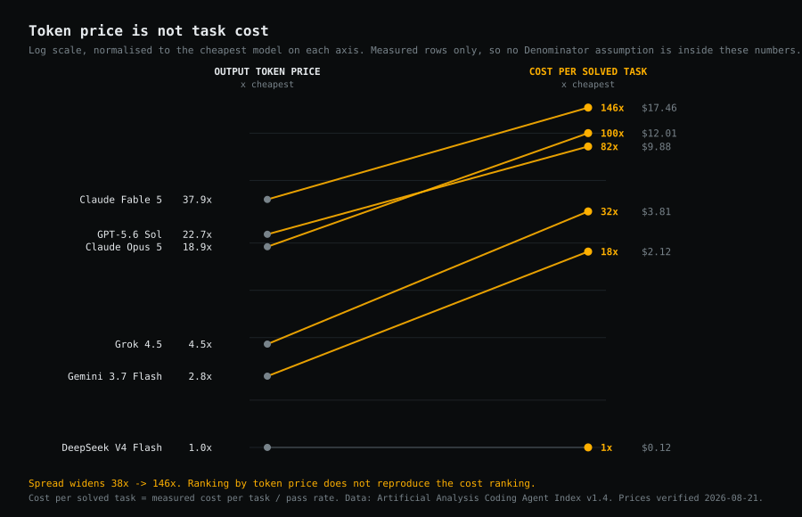
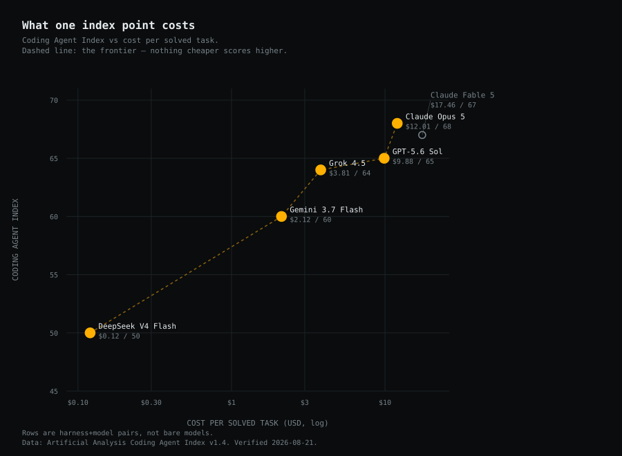
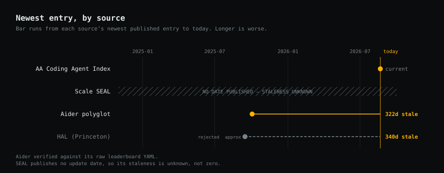

# Cost Per Solved Task

**AI coding models, August 2026.** Every price in this report was verified against the
provider's own pricing page on 2026-08-21. Every pass rate is linked to its source. Nothing
is interpolated; where a number does not exist, this report says so.

---

## The short version

The industry compares AI coding models on price per million tokens. That number is published
on every provider's pricing page, sits in every cost calculator, and is close to useless.

DeepSeek V4 Flash costs **11x less than Claude Opus 5 per input token** and **19x less per
output token**. On measured agentic coding tasks it costs **100x less per solved task**. The
per-token gap understates the real gap by a factor of five, because token price says nothing
about how many tokens a model burns to close a task, or how often it closes one at all.

The denominator is the whole story. Hence the name.

---

## Headline numbers

Two tables, because there are two kinds of number here and merging them would be a lie.

### A. Measured

The benchmark source ran the model and observed what it cost. **No assumption of ours is
inside these figures.**

| Model | Harness | Index | $ / task | **$ / solved task** |
|---|---|---:|---:|---:|
| Claude Opus 5 | Claude Code | 68 | $8.17 | **$12.01** |
| Claude Fable 5 | Claude Code | 67 | $11.70 | **$17.46** |
| GPT-5.6 Sol | Codex | 65 | $6.42 | **$9.88** |
| Grok 4.5 | Grok Build | 64 | $2.44 | **$3.81** |
| Gemini 3.7 Flash | Opencode | 60 | $1.27 | **$2.12** |
| DeepSeek V4 Flash | Codex | 50 | $0.06 | **$0.12** |

Source: [Artificial Analysis Coding Agent Index v1.4](https://artificialanalysis.ai/agents/coding-agents),
326 tasks, 3 attempts each, read 2026-08-21.

### B. Modelled

These models publish a pass rate but no cost. Cost is **our** estimate: an assumed agent loop
model priced at today's verified rates. The assumptions are listed in full in the methodology.

| Model | Source | Pass | Age | Light | Moderate | Heavy |
|---|---|---:|---:|---:|---:|---:|
| GPT-5 | Aider | 88% | 363d | $0.05 | $0.74 | $1.66 |
| o3-pro | Aider | 85% | 419d | $0.52 | $8.48 | $19.08 |
| Gemini 2.5 Pro | Aider | 83% | 441d | $0.05 | $0.78 | $1.76 |
| o3 | Aider | 81% | 422d | $0.05 | $0.89 | $1.99 |
| Claude Opus 4 | Aider | 72% | 453d | $0.52 | $8.33 | $18.75 |
| Claude Sonnet 4 | Aider | 61% | 454d | $0.12 | $1.96 | $4.40 |
| GPT-5.4 | SEAL | 59% | — | $0.12 | $1.86 | $4.19 |
| GPT-4.1 | Aider | 52% | 494d | $0.08 | $1.37 | $5.15 |
| Claude Opus 4.6 | SEAL | 52% | — | $0.24 | $3.85 | $8.67 |
| Gemini 3.1 Pro (preview) | SEAL | 46% | — | $0.12 | $1.91 | $4.30 |
| Claude Opus 4.5 | SEAL | 46% | — | $0.27 | $4.36 | $9.81 |

> **Do not compare table A to table B.** They score different task populations under different
> definitions of "solved". GPT-5's $1.66 and Opus 5's $12.01 are not competing numbers. A is
> measured on 326 agentic tasks; B is our loop model applied to a pass rate from a different
> benchmark. Read each table against itself only.

**Not in either table:** Claude Sonnet 5, Claude Haiku 4.5, GPT-5.6 Terra, GPT-5.6 Luna,
GPT-5.3 Codex, DeepSeek V4 Pro, Grok 4.6, Mistral Medium 3.5. All are priced and current. None
has a published pass rate we could find. They are missing, not zero.

---

## Finding 1 — Token price is not task cost



Rank the six measured models by output token price and you get one order. Rank them by cost
per solved task and you get a different order with a **much** wider spread: the gap between
cheapest and dearest goes from **38x on token price to 146x on cost per solved task**.

Two mechanisms drive the divergence, and neither is visible on a pricing page:

1. **Token burn per task.** A model that reasons less, calls fewer tools, and takes fewer turns
   consumes fewer tokens to close the same task. DeepSeek V4 Flash's per-task cost is 136x below
   Opus 5's, far more than its 19x output-price advantage — the extra factor is behavioural.
2. **Pass rate.** Every failed attempt is paid for and delivers nothing. Dividing by pass rate
   is what converts a price into a cost.

Note that mechanism 2 partly *offsets* mechanism 1 here: DeepSeek's 136x per-task advantage
shrinks to 100x per solved task, because it solves half the tasks and Opus 5 solves two thirds.
Cheap models pay back some of their advantage in retries — but nowhere near all of it.

**The practical read:** if you are choosing a model on the price-per-million-tokens column, you
are using a number that predicts your bill about as well as engine displacement predicts fuel
economy. It is real, it is related, and it is not the thing you care about.

---

## Finding 2 — At the top, one index point costs about $6



The four strongest measured configurations sit within **four index points of each other** — 64
to 68 — and span a **3.2x range in cost per solved task**, from $3.81 to $12.01.

The sharpest pair: **Grok 4.5 scores 64 at $3.81 per solved task. GPT-5.6 Sol scores 65 at
$9.88.** One additional index point costs **$6.06 per solved task**, a 159% premium.

At ten tasks a day, that single point is roughly **$22,000 a year**. Whether it is worth it
depends entirely on what a failure costs you — which is a question about your organisation, not
about the model. What the data can say is that the premium is real, large, and rarely priced
deliberately.

Claude Fable 5 is the instructive outlier: it costs $17.46 per solved task and scores *below*
Opus 5, which costs $12.01. On this benchmark mix it is dominated outright — it sits off the
frontier in the chart above. That is not a claim that Fable 5 is a weaker model; it is a claim
that on these 326 tasks, in this harness, it did not convert its extra spend into extra solves.

---

## Finding 3 — The benchmark everyone cites stopped updating



The Aider polyglot leaderboard is the most-cited cost-aware coding benchmark on the internet.
We checked its raw data file directly, not the rendered page. It contains **zero entries dated
2026**. The newest is **2025-10-03 — 322 days old**. Its top-scoring entries include models
that have since been retired from their providers' APIs.

The Holistic Agent Leaderboard, the other serious cost-tracking effort — 26,597 rollouts across
nine benchmarks, methodologically excellent — has **paused adding new models**. Its newest
entries are from around September 2025, roughly 340 days old.

So the two sources most people reach for cannot price a single 2026-generation model. Meanwhile
the Artificial Analysis Coding Agent Index measures exactly this, updates continuously, and is
absent from most cost calculators — in part, we suspect, because its leaderboard is rendered
client-side and invisible to naive scraping.

Two further consequences of the staleness, visible in our own data:

- **Grok 4** and **DeepSeek V3.2-Exp** have published pass rates but **no current list price**.
  Their providers now price only successor models. The benchmark outlived the product.
- **Scale SEAL publishes no update date at all.** We show its staleness as *unknown* rather
  than assuming it is current. An undated number is not a fresh number.

---

## What this report cannot tell you

Stated plainly, because a methodology section that only lists strengths is marketing.

- **Eight current, priced models have no pass rate anywhere we could find.** Sonnet 5 and
  Haiku 4.5 in particular are widely used and entirely absent from this analysis.
- **Measured rows are harness+model pairs, not models.** "Claude Code + Opus 5" is not a
  property of Opus 5. Artificial Analysis's own harness comparison shows that holding the model
  constant and changing the harness moves the score materially. Do not read table A as a model
  ranking.
- **We treat the Coding Agent Index as a pass rate** (`pass_rate = index / 100`) on the grounds
  that it is documented as an average of task-normalised pass@1 rates. That is our
  interpretation, not the source's statement.
- **Measured costs are at Artificial Analysis's pricing snapshot,** not recomputed at today's
  prices. Per-model token counts are published as charts only, so we cannot reprice them. If a
  provider changed prices between their run and 2026-08-21, table A lags.
- **Table B's cost figures rest on an assumed loop model** that no one has validated against
  real agent traces, including us.
- **Pass rates are benchmark pass rates.** They are not your codebase.

---

## Methodology

### The formula

```
cost_per_attempt     = loops × (tokens_in × input_price + tokens_out × output_price)
cost_per_solved_task = cost_per_attempt / pass_rate
```

Where a source publishes a measured per-task cost, `cost_per_attempt` is that measured figure
and **no loop model, token assumption, or efficiency multiplier is applied**. Our test suite
asserts that changing those assumptions cannot move a measured number.

### Retry variants

Three are computed. The report leads with `naive`.

| Variant | Formula |
|---|---|
| `naive` | `cost / p` |
| `capped` | `min(1/p, K) × cost + residual × (1-p)^K` |
| `truncatedGeometric` | `(E[N] × cost + (1-p)^K × residual) / P(solved within K)` |

Two results worth stating, both proven as tests rather than asserted:

1. **With residual human cost at $0, `truncatedGeometric` reduces exactly to `naive`.** The
   truncation term cancels. `cost / p` is not a naive approximation of the rigorous model; with
   no takeover cost it *is* the rigorous model.
2. **`capped` systematically understates cost for weak models.** Capping expected attempts at 3
   while booking nothing for never-solved tasks means that at a 20% pass rate you bill 3
   attempts instead of 5 and charge $0 for the 51.2% of tasks still unsolved. It makes bad
   models look cheap. We implemented it because it was specified, and we do not lead with it.
   Use it only with a real labour rate in `residual_human_cost_usd`.

### Assumptions in table B

All are labelled `kind: "assumption"` in `data/assumptions.json` and adjustable.

| Parameter | Value | Provenance |
|---|---|---|
| Light tier | 5K in / 1.5K out per loop, 2 loops | digitalapplied, stated by the source as a modelling assumption |
| Moderate tier | 20K in / 4K out per loop, 10 loops | same |
| Heavy tier | 30K in / 6K out per loop, 25 loops | same |
| Frontier efficiency | 0.6x loops on heavy tasks | **House assumption. No published source.** |
| Retry cap | 3 attempts | House assumption |
| Residual human cost | $0 | Default, so no labour rate is silently imputed |
| Cache hit rate | 0% | Default, because caching is harness-specific |

The frontier-efficiency multiplier is the weakest number in this report. It materially
advantages frontier models on the heavy tier, and it exists because we could not find a
published measurement. It is now **demoted to a fallback**: it applies only to table B, never
to table A. Set it to 1.0 in the calculator to see unadjusted results.

### Price handling

Several providers do not have a single price. We record the tier used and state the alternative:

- **Gemini 3.1 Pro** and **Grok 4.5** are prompt-length tiered. We use the sub-200k rate, which
  is correct for every task tier modelled here.
- **Gemini 3.7 Flash** is on promotional pricing that the pricing page says **doubles on
  2027-01-01**.
- **DeepSeek V4** has peak and off-peak rates. We record the **peak** rate, the conservative
  choice.
- **Claude Fable 5** uses a tokenizer that produces roughly **30% more tokens for the same
  text** than pre-4.7 models. Its effective cost is therefore higher than its per-token price
  suggests — a real effect invisible in any price comparison.

### Sources

| Source | Tasks | Covers 2026 models | Publishes cost | Newest entry |
|---|---|---:|---|---|
| [AA Coding Agent Index v1.4](https://artificialanalysis.ai/agents/coding-agents) | 326 | Yes | Yes, measured | Read 2026-08-21 |
| [Scale SEAL — SWE-bench Pro](https://labs.scale.com/leaderboard/swe_bench_pro_public) | 1,865 | Yes | Not published | **Unknown** |
| [Aider polyglot](https://aider.chat/docs/leaderboards/) | 225 | No | Historical only | 2025-10-03 |

Evaluated and rejected: **HAL (Princeton)** — paused updating, newest entries ~Sep 2025.
**llm-stats.com** — human-verification wall, and a mirror of an older index version.

All benchmark data is third-party, cited and linked. None of it is redistributed. Denominator's
own measured runs, when they exist, will be published as open data under CC-BY.

---

## The METR caveat

A METR randomised controlled trial found experienced open-source developers were **19% slower**
when using early-2025 AI tools. They had expected a 24% speed-up, and even after experiencing
the slowdown still believed they had been **20% faster**.

This report measures cost per benchmark-solved task. It does **not** measure developer
throughput, and a low cost per solved task is not evidence of a productivity gain. The two
questions are related but distinct, and the METR result is the strongest available warning
against treating the first as a proxy for the second.

---

## Reproduce this

Every figure regenerates from the repository:

```
npm test          # 31 tests, including data-integrity checks
npm run coverage  # source, coverage and staleness audit
npm run table     # the headline tables
node scripts/charts.ts   # regenerates every chart in this report
```

Change a price in `data/models.json` and every table and chart moves with it. If you think a
number is wrong, the fastest way to prove it is to change it and see what happens.

---

*Prices verified 2026-08-21 against provider pricing pages. Benchmark data read 2026-08-21.
Filed under the verification date rather than a publication date; if this is published later,
the numbers above still carry the date they were checked.*
