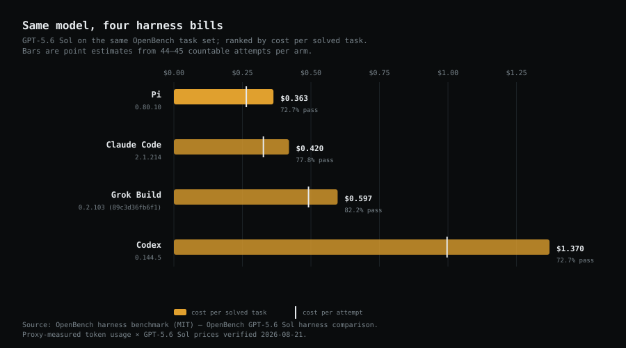

# Same Model, Eight Harnesses

**Three benchmarks that have never met, eight coding harnesses between them, the same result
three times.** OpenBench ran GPT-5.6 Sol through four harnesses and published the token
usage; Solvency repriced it at verified API rates. WildClawBench (InternLM) held four models
constant across four scaffolds, including Hermes Agent and OpenClaw. And on 2026-08-26
Solvency ran the measurement itself: the same GPT-5.6 Sol through five arms of its own
benchmark — Aider, Codex, OpenCode, Hermes Agent, and a bare API call as the no-scaffold
control. Three populations, reported separately below, never sharing a table; together they
cover eight distinct harnesses.

This revision replaces the earlier editions at this URL ("Same Model, Four Harnesses",
2026-08-23; "Six Harnesses", earlier 2026-08-26). Nothing in the earlier tables changed;
a first-party population and the technical groundwork joined them.

---

## What a harness actually is

The word gets used as if it were packaging. It is closer to the drivetrain. Addy Osmani's
[Agent Harness Engineering](https://addyosmani.com/blog/agent-harness-engineering/) gives the
cleanest formulation: **Agent = Model + Harness** — the harness being everything wrapped
around the raw model that turns next-token prediction into finished work. Concretely, five
subsystems wear the one name:

1. **A context assembler** — system prompt, project instructions, skill files, repo maps:
   what the model gets to see, and how many tokens seeing it costs.
2. **A tool broker** — file reads and writes, shell, search, MCP servers: what the model
   gets to *do*, and the round-trips each action spends.
3. **An execution sandbox** — where model-written code actually runs, and what damage it
   cannot do there.
4. **A verification loop** — tests, typechecks, hooks; in Osmani's phrase, "success is
   silent, failures are verbose": failure output is recycled into the next attempt.
5. **A cache manager** — which parts of the context are rebuilt each call, and which are
   re-read at the provider's cached-input discount.

Every one of those subsystems is also a line item. That is this note's subject: the same
model's bill, with only the drivetrain changed.

---

## The short version

Hold the model constant. Hold the task set constant. Change the harness, and the bill moves —
in three benchmarks, independently.

- **OpenBench (15 tasks, GPT-5.6 Sol):** cost per solved task moves from **$0.363 with Pi to
  $1.370 with Codex** — a **3.77x spread at the same 72.7% pass rate**.
- **WildClawBench (60 different tasks, four models):** cost per score-equivalent task moves
  by **1.9x to 2.8x within each model**, and the harness that scores best is never the one
  that bills least.
- **Solvency Bench (12 single-turn tasks, GPT-5.6 Sol, run by Solvency):** every arm scores
  **100%**, and the bill still spans **7.7x** — from Aider's $0.0093 per solved task to
  Hermes Agent's $0.0717. With correctness held perfectly equal, what remains is the pure
  price of the scaffold.

This is not a finding that any harness is universally better. It is a finding that the
harness changes the bill, even when the name in the model column does not. A useful cost
planner therefore has to price the whole agent architecture—not just the foundation model.

---

## Population one — OpenBench: GPT-5.6 Sol through four harnesses



| Harness | Version | Solved | Pass | $ / attempt | **$ / solved** | vs Pi |
|---|---|---:|---:|---:|---:|---:|
| Pi | 0.80.10 | 32/44 | 72.7% | $0.264 | **$0.363** | 1.00x |
| Claude Code | 2.1.214 | 35/45 | 77.8% | $0.327 | **$0.420** | 1.16x |
| Grok Build | 0.2.103 (89c3d36fb6f1) | 37/45 | 82.2% | $0.491 | **$0.597** | 1.64x |
| Codex | 0.144.5 | 32/44 | 72.7% | $0.997 | **$1.370** | 3.77x |

Source: [OpenBench harness benchmark (MIT)](https://openbench.run/openbench/releases/2026-07-21-gpt56/),
verified 2026-08-23 against the release's digest-sealed
[raw results](https://github.com/minghinmatthewlam/openbench/blob/db193457a3d9128cd4d01fd839c2a890c186c9ac/docs/releases/2026-07-21-gpt56/results.jsonl)
and [provenance](https://github.com/minghinmatthewlam/openbench/blob/db193457a3d9128cd4d01fd839c2a890c186c9ac/docs/releases/2026-07-21-gpt56/provenance.json).

### What the dollar figures are

OpenBench did not publish a metered dollar bill. It published complete proxy-measured input,
cache-read and output token totals for these four arms. Solvency divides each total by the
arm's countable attempts and applies the current GPT-5.6 Sol rates:

| Token class | Price / million | Verified |
|---|---:|---:|
| Uncached input | $5.00 | 2026-08-21 |
| Cached input read | $0.50 | 2026-08-21 |
| Output | $30.00 | 2026-08-21 |

We label this basis **source usage repriced**. No Solvency task tier, loop count, cache-hit
assumption, retry cap or frontier-efficiency multiplier is inside these values.

---

## Finding 1 — A matched pass rate, a 3.77x bill

Pi and Codex each solved 32 of 44 countable attempts: **72.7%**. The success denominator is
therefore identical. Their cost difference comes entirely from the observed token mix.

| Harness | Uncached input / attempt | Cache read / attempt | Output / attempt |
|---|---:|---:|---:|
| Pi | 24,086 | 81,024 | 3,442 |
| Codex | 64,828 | 769,419 | 9,593 |

Codex read roughly **9.5x as many cached tokens per attempt**, consumed **2.7x as many
uncached input tokens**, and produced **2.8x as many output tokens** in this release. Cheap
cache reads softened the dollar impact; they did not erase it.

The model price card cannot reveal this difference. Both rows say GPT-5.6 Sol. The usage
pattern belongs to the model-harness system.

---

## Finding 2 — The cheapest attempt was also the cheapest solve

Pi has the lowest point estimate both per attempt and per solved task. Grok Build has the
highest pass-rate point estimate—82.2%—but its higher token usage leaves it **64% more
expensive per solved task than Pi**.

That does not establish a statistically decisive correctness ranking. With only 44 or 45
countable attempts per arm, the correctness intervals are wide. It does establish the
accounting fact behind each point estimate: modest success-rate differences can be outweighed
by large differences in the number and kind of tokens a harness consumes.

---

## Population two — WildClawBench: four models, each through four harnesses

[WildClawBench](https://huggingface.co/datasets/internlm/WildClawBench) (InternLM,
[arXiv:2605.10912](https://arxiv.org/abs/2605.10912), MIT, first published 2026-05-11,
verified 2026-08-26) runs 60 human-authored, long-horizon tasks — a completely different
population from OpenBench's 15 — inside a reproducible Docker container, and grades with
deterministic checks, an environment-state audit and an LLM/VLM judge. Its harness-comparison
leaderboard holds each of four models constant and varies the scaffold across **OpenClaw,
Claude Code, Codex CLI and Hermes Agent**.

Two definitions before the numbers. **Score** here is a graded 0–100 average that can award
partial credit; it is not a strict pass rate, so this table says *score-equivalent task*,
never *solved task*. **Cost** is the per-task average in USD as computed and published by
InternLM at the prices they paid — Solvency cannot reprice these arms because their per-cell
token usage is not published. The dollars are the source's, dated by its paper, not by our
price card.

| Model | Harness | $ / task | Score | min / task | **$ / score-eq task** | vs cheapest |
|---|---|---:|---:|---:|---:|---:|
| GPT-5.4 | OpenClaw | $0.33 | 50.3 | 5.83 | **$0.656** | 1.00x |
| GPT-5.4 | Claude Code | $0.61 | 48.4 | 9.07 | **$1.260** | 1.92x |
| GPT-5.4 | Codex CLI | $0.57 | 56.8 | 7.16 | **$1.004** | 1.53x |
| GPT-5.4 | Hermes Agent | $0.44 | 50.7 | 8.97 | **$0.868** | 1.32x |
| GLM 5 | OpenClaw | $0.19 | 42.6 | 6.22 | **$0.446** | 1.33x |
| GLM 5 | Claude Code | $0.21 | 31.0 | 10.18 | **$0.677** | 2.03x |
| GLM 5 | Codex CLI | $0.13 | 38.9 | 7.84 | **$0.334** | 1.00x |
| GLM 5 | Hermes Agent | $0.44 | 46.4 | 6.62 | **$0.948** | 2.84x |
| MiMo V2 Pro | OpenClaw | $0.44 | 40.2 | 7.63 | **$1.095** | 2.58x |
| MiMo V2 Pro | Claude Code | $0.15 | 29.9 | 9.90 | **$0.502** | 1.18x |
| MiMo V2 Pro | Codex CLI | $0.15 | 35.3 | 6.44 | **$0.425** | 1.00x |
| MiMo V2 Pro | Hermes Agent | $0.26 | 48.1 | 8.30 | **$0.541** | 1.27x |
| MiniMax M2.7 | OpenClaw | $0.12 | 33.8 | 9.18 | **$0.355** | 2.12x |
| MiniMax M2.7 | Claude Code | $0.09 | 32.0 | 10.08 | **$0.281** | 1.68x |
| MiniMax M2.7 | Codex CLI | $0.06 | 35.8 | 8.66 | **$0.168** | 1.00x |
| MiniMax M2.7 | Hermes Agent | $0.11 | 37.1 | 10.30 | **$0.296** | 1.77x |

Dataset: `data/harness-study/wildclawbench.json`. Scaffold builds are recorded by the source
as Docker image tags (`wildclawbench-ubuntu:v1.3`, `wildclawbench-claudecode-ubuntu:v0.2`,
`wildclawbench-codex-ubuntu:v0.0`, `wildclawbench-hermes-agent:v0.5`), not harness CLI
versions — a provenance gap stated here rather than papered over. This table is a
WildClawBench-only group: per the comparability rule it is never merged with population one,
the general leaderboard, or any other task population.

---

## Finding 3 — The harness effect replicates on an independent task set

Population one showed a 3.77x per-solved spread on one model and 15 tasks. Population two
shows, on 60 unrelated tasks: within each of four models, changing only the scaffold moves
the score by up to **15.4 points** (GLM 5: 31.0 under Claude Code, 46.4 under Hermes Agent)
and the cost per score-equivalent task by **1.9x to 2.8x**. Two benchmarks, two task
populations, two grading schemes — one conclusion. The harness is a first-class pricing
variable.

---

## Finding 4 — The best score is never the cheapest score

In population two, Hermes Agent has the top score on three of the four models (GLM 5, MiMo
V2 Pro, MiniMax M2.7) — and is not the cheapest per score-equivalent task for any of them.
On GLM 5 it is the most expensive: $0.948, against Codex CLI's $0.334 at 7.5 points less.
Whether that trade is worth it depends on what a failed task costs you — which is exactly
the question a cost planner should put in front of you, not answer for you.

The flip side: the cheapest harness per score-equivalent task is Codex CLI for three models
and OpenClaw for GPT-5.4. There is no universal winner to name, and this note names none.

---

## Finding 5 — OpenClaw's number is an orchestration layer's number

OpenClaw is a coordinator that delegates the coding turn to a registered harness plugin
rather than an independent execution engine. Its cells therefore measure OpenClaw's
orchestration layered on its bundled delegate, not a fifth engine built from scratch. That
is not a defect — the orchestration tax is real money and worth measuring — but reading its
rows as apples-to-apples with a directly-driven CLI would overstate what was compared. The
same caution applies to any stack that wraps one harness in another.

---

## Population three — Solvency Bench: the harness tax, isolated

On 2026-08-26 Solvency stopped repricing other people's runs and ran its own: the same
GPT-5.6 Sol through five arms of [Solvency Bench](https://github.com/LehmanTrader/solvency/tree/main/bench)'s
single-turn suite — 12 code tasks, deterministic hidden-test graders, 3 trials, temperature
0. A bare API call is the control; every other arm is a real harness driving the same
prompts. Dollars are the harness's own token accounting priced at verified catalog rates
(the subscription arm's flat fee never enters the math; cache writes price at the uncached
input rate, stated).

| Arm | Version | Access | Pass | **$ / solved task** | vs cheapest |
|---|---|---|---:|---:|---:|
| Aider | aider 0.86.2 | metered (OpenRouter) | 100% | **$0.0093** | 1.00x |
| API, no harness | — | metered, single call | 100% | **$0.0095** | 1.01x |
| Codex | codex-cli 0.150.0 | local subscription | 100% | **$0.0248** | 2.65x |
| OpenCode | 1.18.20 | metered (OpenRouter) | 100% | **$0.0364** | 3.90x |
| Hermes Agent | Hermes Agent v0.20.5 (2026.8.19) | metered (OpenRouter) | 100% | **$0.0717** | 7.68x |

Dataset: `data/harness-study/solvency-bench-v0.json`; per-attempt journals under `bench/results/`.
Every arm passed every countable attempt, so pass rate explains none of this spread. The
anatomy does — median tokens per attempt, from the harnesses' own accounting:

| Arm | Fresh input | Cache reads | Cache writes | Output |
|---|---:|---:|---:|---:|
| API, no harness | 103 | 0 | 0 | 288 |
| Aider | 752 | 0 | 0 | 166 |
| Codex | 528 | 15,104 | 0 | 214 |
| OpenCode | 3 | 0 | 6,106 | 171 |
| Hermes Agent | 3 | 0 | 12,682 | 249 |

---

## Finding 6 — A lean harness can be free. A heavy one is a choice.

Aider's whole scaffold is ~750 tokens — and its tighter output discipline (166 median output
tokens against the bare call's 288) more than pays for it: **the harness arm comes in under
no-harness-at-all.** Overhead is not a law of nature; it is a design budget, and it can be
negative.

At the other end, Hermes carries a ~12.7k-token scaffold into every one-shot session. On a
100-token task, that is a 120x context multiplier before any work happens. Nothing about
that is wrong — that scaffold is what buys Hermes its skills, memory and tool surface on
real agentic work — but on a bounded single call it is pure tax, and now it has a price:
**7.7x**.

---

## Finding 7 — Cache strategy beats scaffold size

Codex and Hermes carry scaffolds of similar magnitude (~15k vs ~12.7k tokens). Codex bills
**$0.0248** per solved task; Hermes **$0.0717**. The difference is a single column in the
anatomy table: Codex's scaffold arrives as **cache reads** — billed at GPT-5.6 Sol's $0.50/M
cached rate — while Hermes's arrives as **cache writes**, billed here at the full $5/M input
rate. Same order of context, 2.9x apart on price, decided entirely by whether the harness
re-reads its context at the discount or rebuilds it at list.

This is the cache manager (subsystem five) earning its keep, and it is invisible on every
pricing page in the industry.

---

## Why use a harness at all, then?

Because there are two regimes, and the single-turn suite deliberately lives in the one where
harnesses can only lose. A bounded, self-contained call has nothing for the scaffold to do:
no files to navigate, no tests to run, no failures to recycle. Overhead multiplies the bill;
nothing divides it.

Real software work is the other regime. Cost per **solved** task is `attempt cost ÷ pass
rate` — the scaffold's overhead multiplies the numerator, but its verification loop works on
the denominator, and the denominator is where the leverage is. On Solvency's agentic suite,
the reference tool loop read repos, edited files, ran tests and recycled failures to a
**13-for-13** record at $0.0011–$0.002 per solved task on a value model; a bare single call
cannot run a test at all, so on execution-verified work its effective pass rate — and with
it, cost per solved task — falls off a cliff. The population-two data says the same thing
about scale: scaffold choice moved graded scores by up to 15.4 points on identical models.

Osmani's engineering claim — *"a decent model with a great harness beats a great model with
a bad harness"* — is the capability half. The economics half, measured above: **the harness
decides both what a task costs and whether it gets solved at all; pick its weight to match
the work.** Ship a bounded transform through a lean scaffold or none; ship real repo work
through a harness whose verification loop and cache discipline you have priced.

---

## The harnesses, feature by feature

First-hand observations from running each arm (2026-08-26 builds), plus each project's
documentation — capability notes, not endorsements:

| | Claude Code | Codex | Hermes Agent | OpenCode | Aider | solvency-loop |
|---|---|---|---|---|---|---|
| Models | Anthropic (login/key) | OpenAI (login/key) | any (multiplexer) | any (provider/model) | any (LiteLLM-style) | any (OpenRouter) |
| Headless one-shot | `-p --output-format json` | `exec --json` | `-z --usage-file` | `run --format json` | `--message` | library call |
| Machine-readable usage | full incl. cache r/w | full incl. cache r/w | full incl. reasoning | per-step tokens+cost | tokens line (k-rounded ≥1k) | API usage object |
| Cache behaviour observed | heavy reads | heavy reads | writes each session | writes each session | none (lean prompt) | none |
| Agentic tool loop | yes | yes | yes | yes | edit-focused | minimal by design |
| Execution sandboxing | policy/hooks | sandbox modes | egress controls | permission prompts | none (git-scoped) | docker, network-less |

---

## Finding 8 — A build calculator needs roles, not one model picker

Modern agent systems can route different work to different models. The
[Hermes Agent documentation](https://hermes-agent.nousresearch.com/docs/) describes isolated
subagents and support for multiple model providers; its delegation configuration can assign a
different, cheaper model to subagents. A realistic plan might use Claude Fable 5 as an
orchestrator and lower-priced models for parallel workers.

The correct unit to price is a call graph:

```
role_cost = expected_invocations
          × (fresh_input × input_price
             + cached_input × cache_read_price
             + output × output_price)

cost_per_build_attempt = harness_overhead + sum(role_cost)
```

Fallbacks and retries add their expected cost explicitly. For example, a fallback contributes
`P(primary failure) × fallback cost`. Solvency should always report cost per attempted build
and monthly spend. It should report cost per completed build **only** when the user supplies
or Solvency measures an end-to-end system success rate.

Individual model benchmark scores cannot be averaged or multiplied into a credible composed
success rate. Until the system is measured, the honest result is: **success rate not supplied**.

> **Price your own architecture:** [Open the Build Composer](/build-planner). Enter any public,
> internal or custom harness, then mix orchestrator, worker and fallback models role by role.

---

## What this report cannot tell you

- **It is one release.** The four arms cover 15 admission-gated tasks and 44–45 countable
  attempts each. They demonstrate a harness effect; they do not estimate its universal size.
- **It is a point-estimate cost comparison.** Wide correctness intervals prevent strong claims
  about the middle of the pass-rate ranking.
- **The dollars are a reprice, not a subscription invoice.** OpenBench used subscription-backed
  GPT-5.6 Sol access. Solvency applies API token rates so the usage has a common dollar basis.
- **Pi is provisional.** OpenBench flagged Pi for a rerun after a surprising per-task swing.
- **The exclusions matter.** Cursor and OpenCode are absent because their tokens were
  CLI-self-reported rather than proxy-measured. Devin is absent because its split usage was
  incomplete. Including them would mix measurement bases.
- **It says nothing about arbitrary stacks.** A Hermes + Fable + worker-model plan is a
  user-modelled architecture until traces or a controlled benchmark measure that exact system.
- **Population two's dollars cannot be repriced or dated to a run day.** WildClawBench does
  not publish per-cell token usage for the harness-comparison arms, states no run dates for
  that table (the paper's 2026-05-11 v1 is the only anchor), and states no trial counts. Its
  cost figures are the source's own computation at the prices it paid.
- **Population two's score is not a pass rate.** It is a graded 0–100 average with partial
  credit and an LLM/VLM judge in the loop. That is why its derived column is cost per
  score-equivalent task and is never called cost per solved task, and why the two populations
  cannot be ranked against each other.
- **Population three is single-turn by construction.** It isolates scaffold overhead by
  removing every task where a scaffold could help; it says nothing about these harnesses'
  agentic quality, and its 12-task size is a smoke-signal tier (±27pp worst-case CI on any
  pass-rate claim — moot here at 36/36 per arm, stated anyway).
- **Population three's dollars are usage repriced at catalog list rates.** The Codex arm ran
  on a subscription login (basis `subscription_usage_repriced` — precedent: population one);
  metered arms ran via OpenRouter. Cache writes price at the uncached input rate; vendors'
  write premiums are not modelled.
- **Aider's token counts are its own rounded reporting** (k-rounded above 1,000), recorded
  as reported.
- **The two Claude Code rows are not the same Claude Code.** Population one pins CLI 2.1.214;
  population two records a Docker image tag from a different build line, months apart. Even
  the shared harness name does not license a cross-population comparison.

---

## Methodology

For every admitted harness arm:

```
cost_per_attempt =
  (uncached_input_total / countable_attempts) × $5 / 1,000,000
  + (cache_read_total / countable_attempts) × $0.50 / 1,000,000
  + (output_total / countable_attempts) × $30 / 1,000,000

cost_per_solved_task = cost_per_attempt / (solved / countable_attempts)
```

The source's infrastructure and rate-limited failures remain excluded exactly as its
methodology specifies. The four harness rows are isolated from Solvency's general model
leaderboard and are never compared across benchmark populations.

For every WildClawBench cell (population two):

```
cost_per_score_equivalent_task = cost_usd_per_task / (score_pct / 100)
```

with `cost_usd_per_task` and `score_pct` transcribed verbatim from the source's published
harness-comparison table into `data/harness-study/wildclawbench.json`. The "vs cheapest"
multiplier compares within one model's four cells only.

For every Solvency Bench arm (population three):

```
cost_per_attempt = (fresh_in × in_rate + cache_read × cached_rate
                    + cache_write × in_rate + output × out_rate) / 1e6
cost_per_solved_task = mean(cost_per_attempt) ÷ pass_rate
```

with usage from each harness's own accounting and rates from the verified catalog
(`solvency-bench-v0`, journals in `bench/results/`, study file in
`data/harness-study/solvency-bench-v0.json`).

```
node bench/runner.mjs --selftest      # verify every grader, free
node bench/runner.mjs --model openai/gpt-5.6-sol --harness aider --trials 3
```

### Reproduce this

The table and chart regenerate from the repository's canonical data:

```
npm test
npm run charts
npm run charts:light
node scripts/render-pdf.ts reports/2026-08-same-model-four-harnesses.md
```

The report tests parse every published row in both populations. Population one re-derives its
pass rate, per-attempt cost, per-solved cost and relative multiplier through the same engine
used by the website; population two re-derives every score-equivalent figure and multiplier
from `data/harness-study/wildclawbench.json`. OpenBench source data was verified 2026-08-23;
WildClawBench was verified 2026-08-26; GPT-5.6 Sol API prices were verified 2026-08-21, so no
source or price appears fresher than it is.
